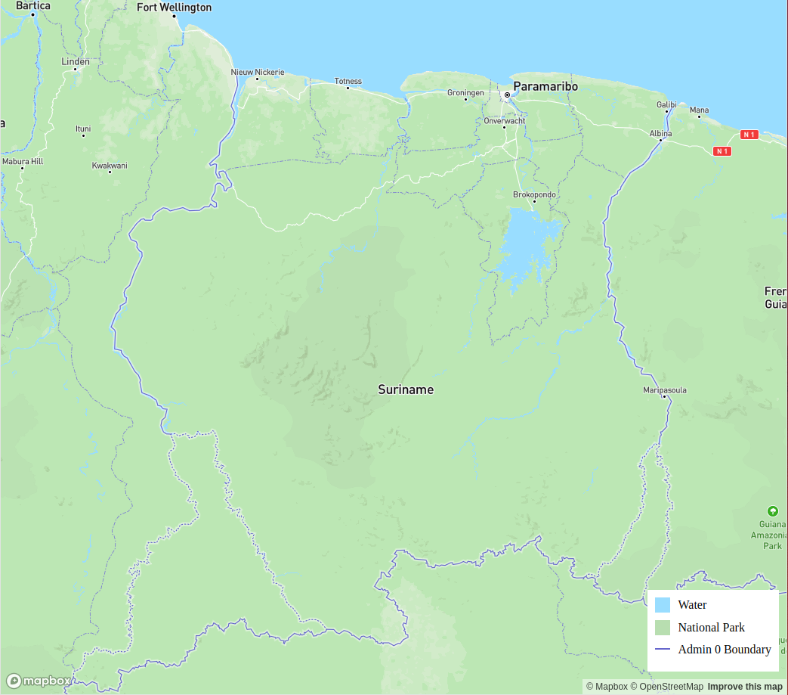

# Map GL dynamic legend

This is a sample Mapbox HTML template that creates a legend div based on the layer IDs you provide in the `layerIds` array. The template dynamically pulls the layer color and type (currently supporting `fill`, `line`, and `circle` types) from the map stylesheet, and uses these to populate the layers in the legend div. Depending on the type, the legend item will show a box, line, or circle, respectively, and apply the layer's color. Additionally, it applies minor regex transformations to make the layer IDs more readable.

